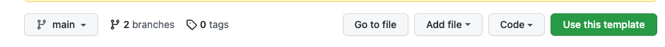
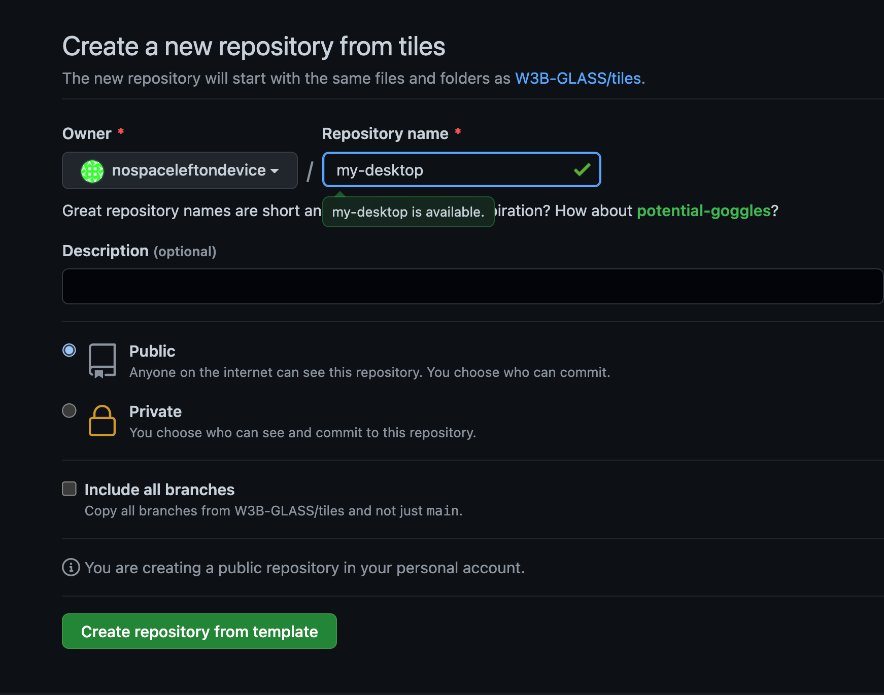

# W3B Glass Tiles
This code template is designed to demonstrate a user interface for Web3

In the `./vendor/github.com/dabit3/polygon-ethereum-nextjs-marketplace/config.js` file, simply add your contract addresses (they can all be the same)
- marketplaceAddress = "0x94F4a38726570f41693CD1aC9DefFab22AF819b4"
- w3b_bio_marketplaceAddress = "0xb745845A511fF4D328D534c59A6eBb547a57D9B0"
- s33d_fund_marketplaceAddress = "0x82f0C2EaA252B65416210F309Ac48B5a749fa5d5"


## Live Demo
1. [Live on GitHub pages](https://w3b-glass.github.io/tiles/)


The live demo displays:
* A crowdfunding app
* A link-in-bio app (integrated with Lens protocol)
* A Web3 Store


### GitHub Pages
On GitHub, the code is available at https://github.com/W3B-GLASS/tiles

To get this working with GitHub pages, do the following:

1. Click `Use this template`



2. Name the repo and ensure you check off `Include all branches`. Click `Create repository from template`



3. Under the `Settings` tab, select the `Pages` menu item and copy the URL where your site is published. 

# Attribution

Special thanks to the great development teams and individuals for which the majority of this project is based on.

This repo utilized `git-vendor` to incorporate the below repositories.

```
DragDropInteractions@master:
	name:	DragDropInteractions
	dir:	vendor/github.com/codrops/DragDropInteractions
	repo:	https://github.com/codrops/DragDropInteractions
	ref:	master
	commit:	7a787ab956ad3564532b63a06f2052237be771b1

Ventus@master:
	name:	Ventus
	dir:	vendor/github.com/rlamana/Ventus
	repo:	https://github.com/rlamana/Ventus.git
	ref:	master
	commit:	816c38f30aaa7c579408204077bb463e3ab293f5

lens-protocol-frontend@main:
	name:	lens-protocol-frontend
	dir:	vendor/github.com/dabit3/lens-protocol-frontend
	repo:	git@github.com:dabit3/lens-protocol-frontend.git
	ref:	main
	commit:	e7f940fa2100aa190461e42d6a42b51faef9f51e

marketplace@main:
	name:	marketplace
	dir:	vendor/github.com/dabit3/polygon-ethereum-nextjs-marketplace
	repo:	https://github.com/dabit3/polygon-ethereum-nextjs-marketplace.git
	ref:	main
	commit:	bc59a023a54df299039c3e39620f2d483276959e
```
